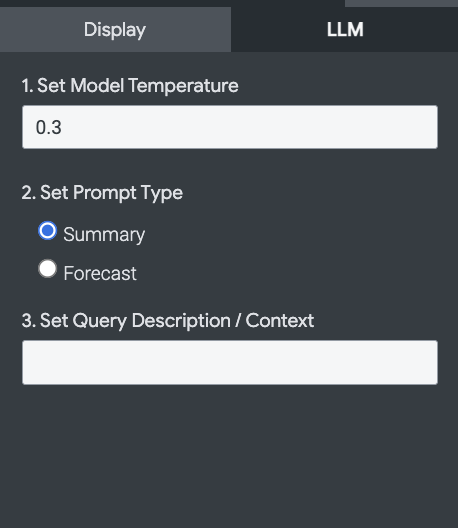

# Looker Query Insights Extension

## Introduction

The Looker Query Insights Extension is a powerful custom visualization tool designed to summarize and present insights from any query created in a Looker explore. This extension provides a flexible and customizable interface, allowing users to tailor both the model parameters and UI to their specific needs. Inspired by [this awesome Looker Hackathon Project](https://github.com/Juventin/looker_gemini_insight), check it out!


## Features

- Custom visualization for summarized insights
- Compatibility with any Looker explore query
- Fully customizable model parameters and user interface
- Seamless integration with Looker, BigQuery, and Vertex AI
- Flexible frontend and backend architecture

## Technologies

- **Looker**: Used as the primary platform for data exploration and visualization
- **BigQuery**: Serves as the data warehouse for storing and querying large datasets
- **Vertex AI**: Provides advanced machine learning capabilities for generating insights
- Frontend: [List the main frontend technologies/frameworks used, e.g., React, TypeScript]
- Backend: [List the main backend technologies/frameworks used, e.g., Python, Flask]

## Project Structure
**only highlighting key files**
```
📦 looker-query-insights/
├─ query-insights-backend/
│  ├─ README.md # instructions for Backend installation
│  └─ terraform/
│     ├─ variables.tf # GCP Project variables
│     └─ main.tf # GCP resource provisioning
└─ query-insights-extension/
   ├─ README.md # instructions for Extension installation
   ├─ manifest.lkml # the file required for configuring this extension in a Looker LookML project
   ├─ .env # where required environment variables are added
   ├─ package.json # where dependencies and startup/build commands are described
   └─ src/
      ├─ index.js # where the Looker Extension SDK is first loaded and the app is mounted
      ├─ constants.js # where the Looker Viz Config Options are configured
      └─ composables/
         └─ useLookerVertexMessage.js #Handles Looker Query to Vertex for Prediction
```

## Installation

Getting started involves (in order):

1. [Backend Setup](query-insights-backend/README.md). **To note, if you've installed the Explore Assistant and have it configured in your Looker instance the Backend setup can be skipped. You can use the same backend resources for this extension**
2. [Frontend Setup](query-insights-extension/README.md)

## Usage
This Looker Extension is mounted as a Custom Visualization, meaning that once installed you can access it from any Looker Explore as a visualization offering. Additionally it provides two tabs for editing the visualization as an end user: LLM configuration & UI Customization.

### LLM Configuration


In the Explore Visualization config, the LLM tab will allow you to customize the prediction request with 3 parameters:
1. Set Model Temperature (customize variability of reponse)
2. Set Prompt Type (summary of results vs. forecast of time-series data)
3. Set Query Description/Context (pass in any additional user provided context to the prompt sent to the llm)

### UI Customization


In the Explore Visualization config, the Display tab will allow you to customize the look and feel of the visualization with 7 parameters: theme color, background color, card color, header color, shadown color, text color, and image url.

## Acknowledgements

Inspired by [this awesome Looker Hackathon Project](https://github.com/Juventin/looker_gemini_insight) by [Juventin](https://github.com/Juventin).
